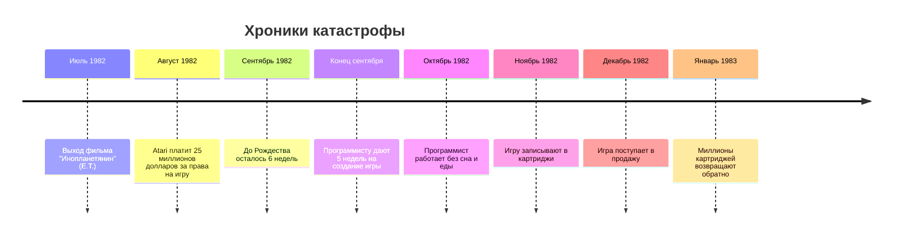
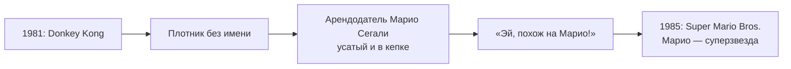

## Кризис и воскрешение

Почему в 1983 году люди перестали покупать игры и как Марио спас индустрию

---

Представь, что ты заходишь в магазин игрушек, а там... горы мусора. Пластиковые коробки с играми, в которые невозможно играть. Кривые гонки, стрелялки без выстрелов, персонажи, которые даже не двигаются. Но на коробках — яркие картинки с обещаниями чуда.

Именно так выглядел 1983 год в Америке. Рынок видеоигр рухнул так сильно, что люди перестали верить в игры вообще. Казалось, что эпоха видеоигр закончилась навсегда.

Но случилось чудо. И звали это чудо **Марио**.

---

### 📉 Как всё испортили: жадность и глупость

После успеха Pong и Atari все хотели заработать на играх. Компании плодились как грибы после дождя. Каждый, у кого был гараж и паяльник, пытался выпустить свою игру.

Проблема была в том, что **контроля за качеством не было никакого**.

> 🏭 **Фабрики штамповали игры как пирожки:**
> - Сегодня придумали название
> - Завтра нарисовали красочную коробку
> - Послезавтра запихнули внутрь пустую болванку
> - И готово — игра в магазине!

Люди покупали, несли домой, включали... а там пустота, баги или просто каша на экране. Деньги потрачены, счастья нет.

---

### 💀 Худшая игра в истории

Был один случай, который добил рынок окончательно. Компания Atari (та самая, что создала Pong) решила выпустить игру по суперпопулярному фильму — **«Инопланетянин» Стивена Спилберга**.

Звучит круто? Фильм собрал миллиарды, все дети обожали пришельца E.T.

Но вот что случилось на самом деле:



**В чём была проблема?**

Игру делал **один человек** за **5 недель**. Это как построить небоскрёб лопаткой для песка за выходные. Невозможно!

Игра получилась ужасной:
- Персонаж постоянно падал в ямы
- Непонятно было, куда идти
- Графика — цветные пятна
- Управление — как будто джойстик сломался

Люди несли игру обратно в магазины тысячами. Atari осталась с горами непроданных картриджей.

---

### 🏜️ Великое захоронение

Картриджей было так много, что Atari не знала, что с ними делать. Продать нельзя — все ненавидят игру. Выкинуть в мусорку — дети найдут и будут играть в этот кошмар.

И тогда они придумали гениальное (или безумное) решение:

> 🚜 **Ночью, в пустыне Нью-Мексико, под охраной, тяжёлая техника закапывала миллионы картриджей в землю.**

Их залили бетоном, чтобы никто никогда не откопал это позорище. Легенда гласит, что там похоронено 14 грузовиков игр — не только E.T., но и другие провальные картриджи.

*(Спустя 30 лет энтузиасты действительно раскопали это место и нашли обломки игр. Легенда оказалась правдой!)*

---

### 📉 Крах: что пошло не так

К 1983 году ситуация стала катастрофической:

| Проблема | Как это выглядело |
|----------|-------------------|
| **Слишком много игр** | Магазины завалены коробками, глаза разбегаются |
| **Никакого качества** | 9 из 10 игр — полный мусор |
| **Люди разочаровались** | «Купили игру — выбросили деньги на ветер» |
| **Магазины отказываются** | «Не хотим это продавать, никто не покупает» |
| **Atari теряет миллиарды** | Компания, создавшая индустрию, разваливается |

Рынок видеоигр в США **рухнул на 97%**. Это как если бы сейчас все игровые магазины закрылись, а новые игры перестали выходить. Конец.

Казалось, видеоигры умрут навсегда. Но...

---

### 🗾 А в это время в Японии...

Пока в Америке хоронили картриджи в пустыне, в Японии маленькая компания **Nintendo** спокойно делала своё дело. Они выпускали карточные игры и игрушки, но решили попробовать видеоигры.

У них было одно важное правило:

> ✅ **Никакого мусора. Каждая игра должна быть идеальной.**

Nintendo придумала хитрый ход. Они сделали приставку **Nintendo Entertainment System (NES)** и встроили в неё специальный чип — **блокиратор**. Если картридж был не от Nintendo или некачественный — приставка просто не включалась!

Так они отсекли весь мусор, который убил американский рынок.

---

### 🦸 Кто такой Марио?

А теперь познакомься с героем. В 1981 году Nintendo сделала игру про большую гориллу, которая похитила девушку. Игру назвали **Donkey Kong**. А плотника, который спасал девушку, звали... **Прыгающий Человек**.

Звучит глупо, правда? Прыгающий Человек — так себе имя для героя.

Когда игру привезли в Америку, хозяин склада Nintendo заметил, что плотник похож на их арендодателя — **Марио Сегали**. Толстый, усатый, в кепке. И сказал: «Эй, да это же Марио!»

Так Прыгающий Человек стал **Марио**.



---

### 🌟 1985: Игра, спасшая мир

Nintendo выпустила игру, которая изменила всё. **Super Mario Bros.**

Что в ней было такого особенного?

```
╔══════════════════════════════════════╗
║         SUPER MARIO BROS.            ║
╠══════════════════════════════════════╣
║  ┌────┐              ┌────┐         ║
║  │    │  👨🟫  👾      │    │         ║
║  │    │   │          │    │         ║
║  └────┘  ═╧═         └────┘         ║
║            🟫                        ║
║            🟫                        ║
║            🏳️                        ║
║                                      ║
║  МИР 1-1           ❤️ ×3   🔟×20    ║
╚══════════════════════════════════════╝
```

Вот почему в неё влюбились все:

| Что нового | Как это работало |
|------------|------------------|
| **Яркие цвета** | Не чёрно-белое старьё, а сочный мультик |
| **Музыка** | Весёлая мелодия, которая навсегда врезалась в память |
| **Уровни** | Не просто экран, а целый мир с секретами |
| **Бонусы** | Гриб (становишься большим), цветок (стреляешь огнём), звезда (неуязвимость) |
| **Сюжет** | Спасти принцессу от злого дракона — просто и понятно |
| **Управление** | Прыжок, бег — всё отзывается мгновенно |

Это была первая игра, в которой хотелось **исследовать каждый уголок**. Спрятанные комнаты, секретные монетки, короткие пути — всё это было впервые.

---

### 🧱 Как Марио всех спас

Люди, разочарованные мусорными играми, увидели Super Mario Bros. и ахнули:

> 😲 «Так игры могут быть **классными**?»

Магазины снова начали продавать приставки. Дети забыли про старые разочарования. Родители снова поверили, что видеоигры — это не пустая трата денег.

Nintendo ввела правила, которые спасли индустрию:

| Правило Nintendo | Почему это важно |
|------------------|------------------|
| **Печать качества** | Значок на каждой игре — гарантия, что внутри не мусор |
| **Контроль картриджей** | Только Nintendo могла выпускать игры для своей приставки |
| **Тестирование** | Каждую игру проверяли, чтобы не было багов |
| **Ограничение игр** | Разработчики могли выпускать только 5 игр в год (чтобы не штамповать халтуру) |

---

### 📊 До и после Марио

| Что было ДО Марио (1983) | Что стало ПОСЛЕ Марио (1987) |
|--------------------------|------------------------------|
| Игровой рынок мёртв | Рынок ожил и растёт |
 | Люди не верят в игры | Люди снова покупают приставки |
| Atari развалилась | Nintendo — король мира |
| В играх только мусор | В играх появилось качество |
| E.T. похоронен в пустыне | Марио на каждом экране |

---

### 👑 Марио — король навсегда

С тех пор Марио стал символом видеоигр. Его узнают даже бабушки, которые никогда не играли. Он появился в сотнях игр:

```
Super Mario Bros. (1985)
    │
    ├── Super Mario World (1990)
    ├── Super Mario 64 (1996)
    ├── Super Mario Galaxy (2007)
    ├── Super Mario Odyssey (2017)
    └── И ещё 200+ игр
```

Каждый раз, когда ты видишь усатого толстяка в красной кепке, помни: этот парень когда-то спас целую индустрию. Без него, возможно, мы бы сейчас вообще не играли в видеоигры.

---

### 🏆 Что мы выучили

| Урок | История |
|------|---------|
| **Жадность убивает** | Слишком много плохих игр убили рынок |
| **Качество важнее количества** | Одна хорошая игра лучше сотни мусорных |
| **Один герой может всё изменить** | Марио спас индустрию |
| **Контроль — это хорошо** | Блокиратор Nintendo отсеял халтуру |
| **E.T. похоронен в пустыне** | Буквально |

---
## подпись кто сделал
